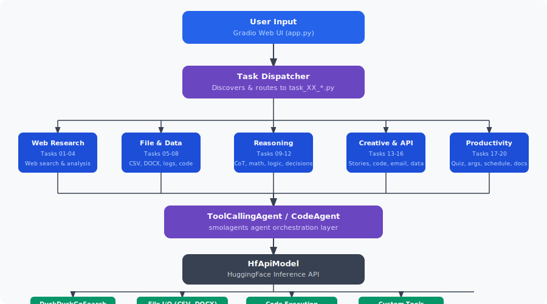

# Smolagents Task Library

> Made Autonomously Using [NEO - Your Autonomous AI Engineering Agent](https://heyneo.com)
>
>   

Twenty runnable agent tasks built on HuggingFace's [`smolagents`](https://github.com/huggingface/smolagents) — a reference collection for the framework that has no reference collection yet.

## Why This Library Exists

`smolagents` picked up 4,100 GitHub stars in April 2026 on the strength of a simple pitch: a lightweight agent library with tool use and code execution that works against any model, hosted or local. It is genuinely good. It is also new — and new frameworks have the same problem every time. The README shows you a calculator agent. The documentation shows you a weather agent. Neither answers the question a developer actually has:

**What does a real task look like?**

Not a demo. Not a toy. Something that parses actual CSV files, something that reviews actual code, something that produces output an actual human would read and find useful. That gap is the reason `smolagents` adoption is bottlenecked on people who have enough time to reverse-engineer the patterns for themselves.

This repository closes the gap. It is twenty concrete tasks, each one a complete working example of how to structure a real agentic job in `smolagents`. They are not intended to be novel research — they are intended to be the reference you copy from when you sit down to build your own agent and realise you do not know what the shape of one is supposed to look like.

## What Is In It

Twenty self-contained tasks, organised into five categories. Every task is a standalone Python file with a `run()` function, a CLI entry point, and sensible defaults so it will execute the moment you hand it a `HF_TOKEN`.

**Web research.** Structured-report web search, news digest from any topic, URL content analyser with HTML noise stripped, multi-source trend tracker with predictions.

**File and data processing.** Pandas-backed CSV summariser with AI insight extraction, DOCX analyser that pulls both prose and tables and classifies the document type, log-file parser that categorises errors into P1/P2/P3, full code-quality reviewer with security and style notes.

**Reasoning.** Chain-of-thought problem decomposition, step-by-step math solver backed by a `CodeAgent` that can actually execute Python for numeric verification, logic-puzzle solver, decision analyser that produces weighted pros/cons.

**Creative and API integration.** Story generator with a custom `StoryGeneratorTool` (a worked example of writing your own `smolagents` tool), plain-English code explainer, tone-controlled email drafter, unstructured-text-to-structured-data formatter (JSON / CSV / Markdown tables).

**Productivity.** Multiple-choice quiz builder with configurable difficulty, argument analyser with fallacy detection, meeting scheduler, document summariser with brief / detailed / bullet-point modes.

A full index of the twenty tasks with filenames is available in `tasks/` — each file is named `task_NN_<slug>.py` and is readable top-to-bottom in a couple of minutes.

## Why The Collection Is Structured This Way

The twenty tasks are not arbitrary. They were chosen to cover the full surface of what `smolagents` was designed for:

- **`ToolCallingAgent` vs `CodeAgent`.** The math solver and code reviewer show where you want the agent to execute Python mid-run; the email drafter and story generator show where you do not.
- **Built-in tools vs custom tools.** Web-search tasks lean on `smolagents`' built-in tooling. The story generator ships its own `Tool` subclass — the single most common thing users want to know how to do and the single most underexplained part of the docs.
- **Deterministic output shape.** Several tasks (log analyser, data formatter, quiz creator) return structured output the surrounding program can use, not free-form prose. This is the pattern most real applications actually need and most tutorials ignore.
- **Model and provider indirection.** Every task imports its model configuration from a shared `config.py` so you can swap from HuggingFace Inference to OpenRouter to a local model without editing twenty files. This is the configuration layer teams always end up writing and rarely get right the first time.

Read any three tasks and the `smolagents` surface area stops feeling abstract.

## Two Ways To Run It

**From the command line.** Every task file works as an executable — `python tasks/task_10_math_solver.py --problem "..."`. This is the mode you want for scripting, piping output into other tools, or running a task inside CI.

**Through the Gradio web UI.** `python app.py` launches an interface that discovers every `task_XX_*.py` file in the directory, presents them in a dropdown, and lets anyone (not just the person who installed it) run a task by typing input into a textbox. This is the mode for sharing the library with teammates, or for publishing a Space on HuggingFace so the entire community can try the tasks without cloning anything.

## Configuration

All credentials and model choices live in `.env`. The only required variable is `HF_TOKEN`. `DEFAULT_MODEL` and `DEFAULT_PROVIDER` let you pick which model and inference provider every task uses, `OPENROUTER_API_KEY` is optional and only needed if you route through OpenRouter instead of HuggingFace Inference. A `.env.example` file ships with the repository.

## Who Should Use It

- **Developers evaluating `smolagents`** who need to see the framework holding up under real workloads before committing to it.
- **Teams building internal agent tools** who want a set of working patterns to fork from rather than starting from the docs.
- **Educators and content creators** who need concrete, varied examples to teach agent concepts against.
- **Anyone who has opened the `smolagents` README, thought "that is cool, but what do I actually do with it," and closed the tab.**

## Tech Stack

Python 3.9+, `smolagents` for the agent framework, `gradio` for the web UI, `huggingface-hub` for model access, `python-dotenv` for credentials, and task-specific libraries (`pandas`, `python-docx`, `beautifulsoup4`, `requests`) pulled in only where needed. Full list in `requirements.txt`.

## License

MIT.
